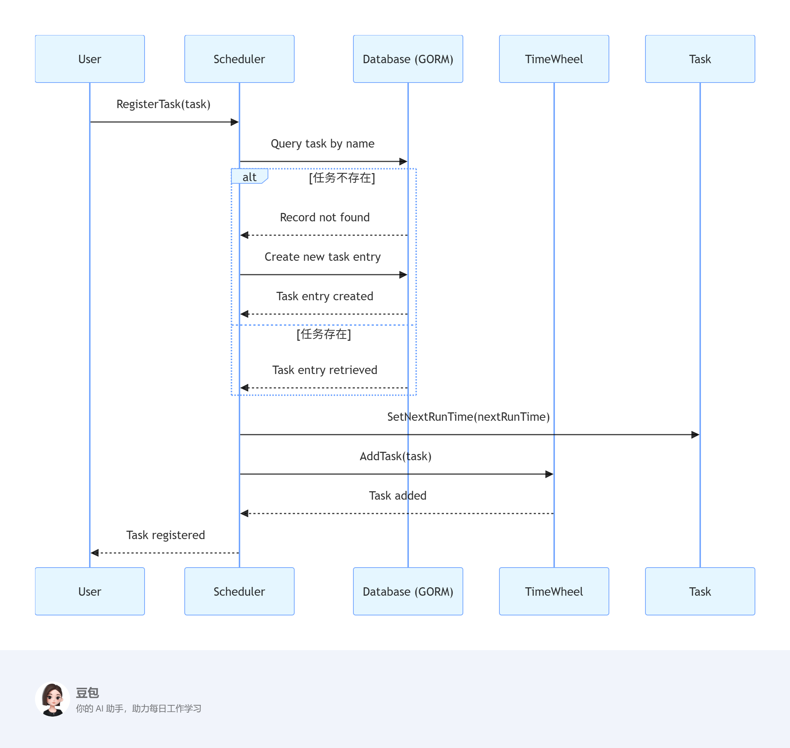
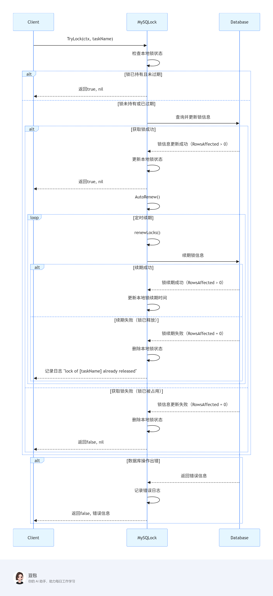
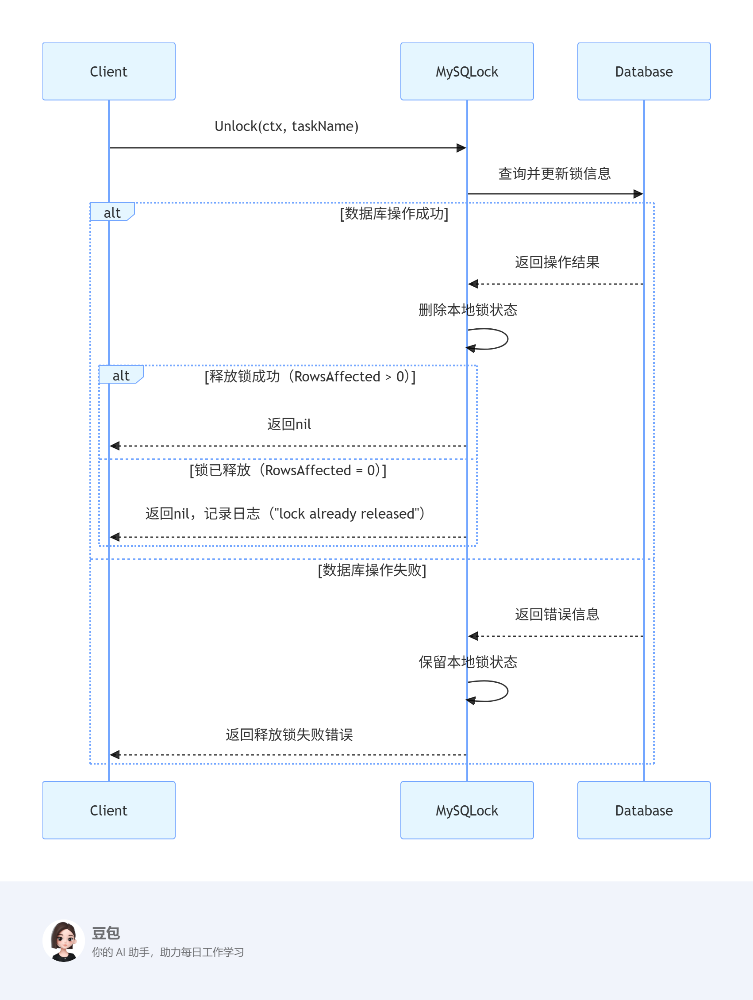
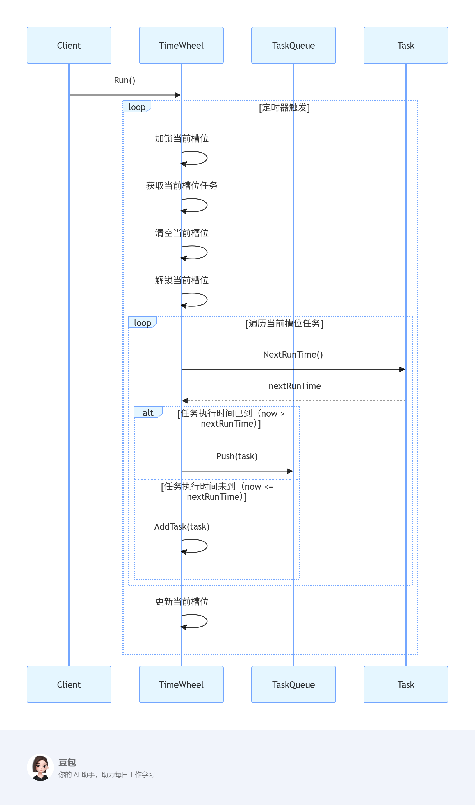
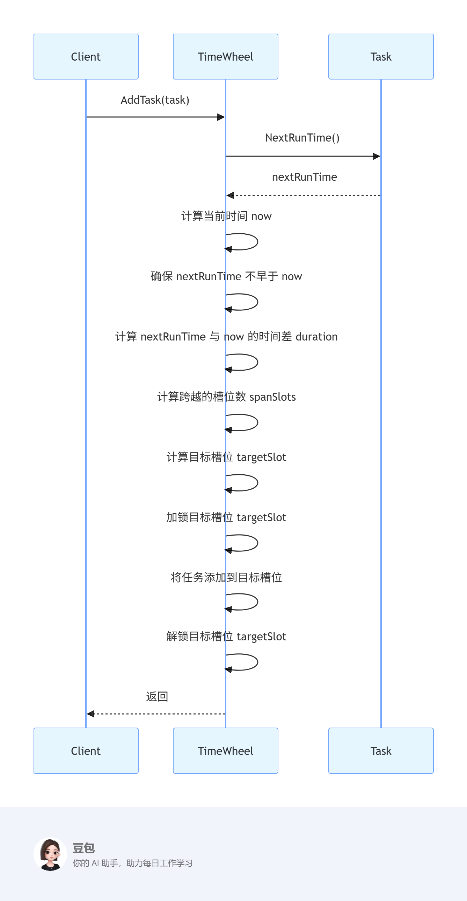

# Scheduler 组件工作原理说明

本目录下的 Scheduler 组件实现了一个支持分布式环境的任务调度系统，具备高效的任务注册、分发、并发控制和定时调度能力。本文将结合架构说明和 images 目录下的工作序列图，帮助开发者快速理解其核心原理。

## 1. 整体架构

Scheduler 主要由以下核心模块组成：
- **任务队列（TaskQueue）**：用于缓存待执行的任务。
- **时间轮（TimeWheel）**：高效的定时任务调度机制。
- **分布式锁（Lock）**：保证多节点环境下任务不会被重复调度。
- **任务注册与分发机制**：支持动态注册任务并分发到合适的节点。

## 2. 任务注册与分发机制

任务通过注册接口动态注册到调度器。调度器会根据任务的下次执行时间，将其分配到时间轮的对应槽位。每当时间轮转动到某一槽位时，会将该槽位的任务推送到任务队列，等待调度执行。

- 任务注册流程如上图所示。
- 任务分发时会先尝试获取分布式锁，确保同一任务在分布式环境下只会被一个节点执行。

## 3. 分布式锁实现原理

分布式锁用于保证多实例部署时任务不会被重复调度。常见实现方式有基于 Redis、数据库等。锁的获取和释放流程如下：

- 调度器在分发任务前，先尝试获取任务对应的分布式锁。
- 获取成功后才会执行任务，执行完毕后释放锁。
- 若获取失败，则跳过该任务，等待下次调度。

锁释放流程

## 4. 时间轮任务调度流程

时间轮是一种高效的定时任务调度算法，将时间划分为若干槽位，每个槽位存放即将在该时间段内触发的任务。调度流程如下：

- 时间轮以固定时间间隔（如100ms）转动，每次转动检查当前槽位的所有任务。
- 若任务到达执行时间，则推送到任务队列等待执行。
- 未到执行时间的任务会重新分配到合适的槽位。

## 5. 关键流程图示

- 任务添加到时间轮流程：

- 分布式锁获取与释放流程：

- 调度器整体注册与分发流程：

## 6. 总结

Scheduler 通过时间轮实现高效的定时调度，通过分布式锁保证任务在多节点环境下的唯一性，支持灵活的任务注册与分发机制，适用于分布式任务调度场景。建议结合源码和上述流程图深入理解各模块实现细节。